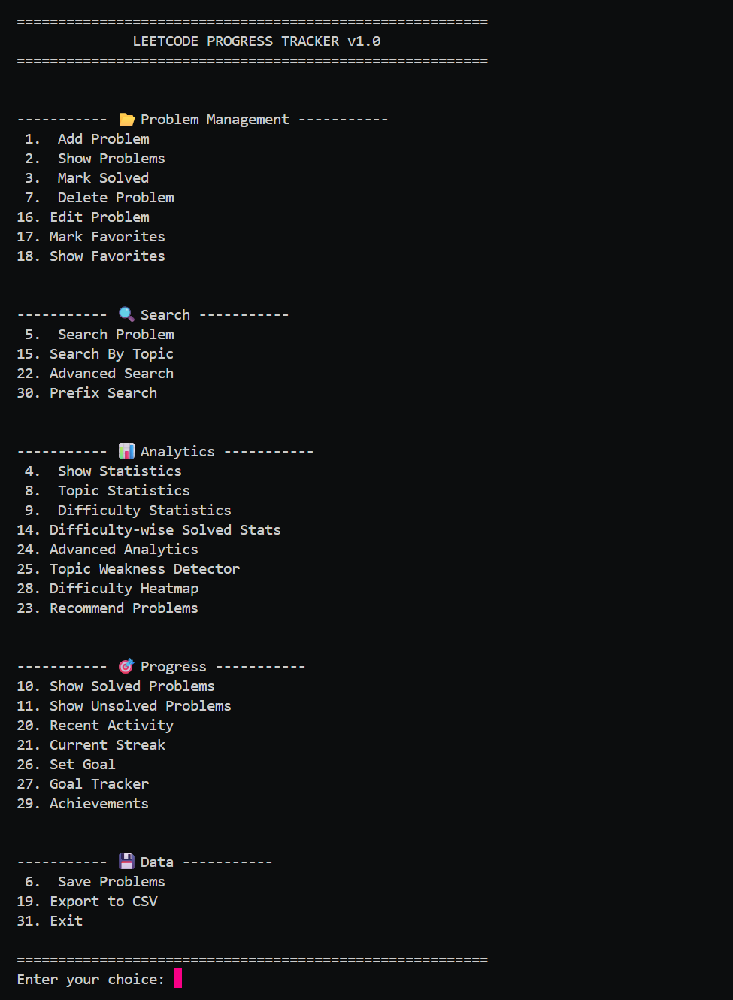
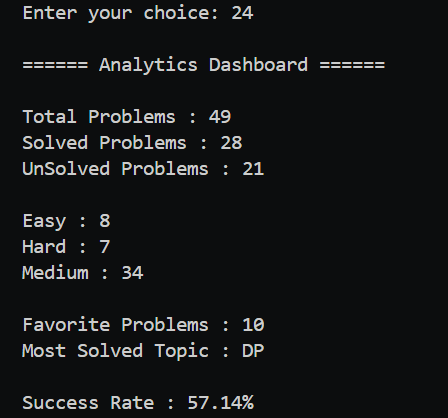
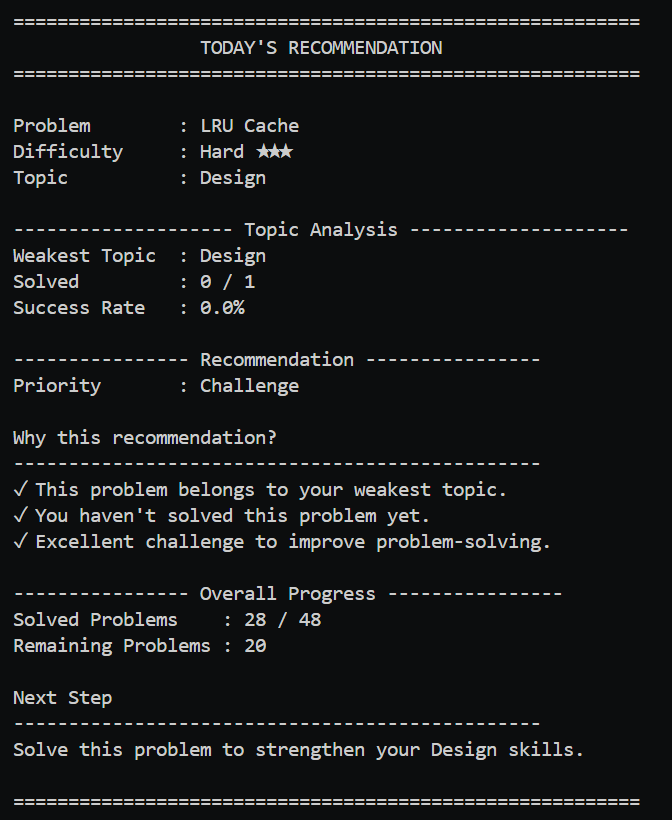
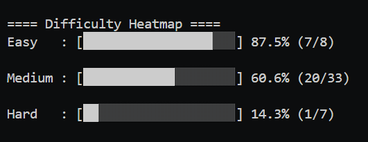
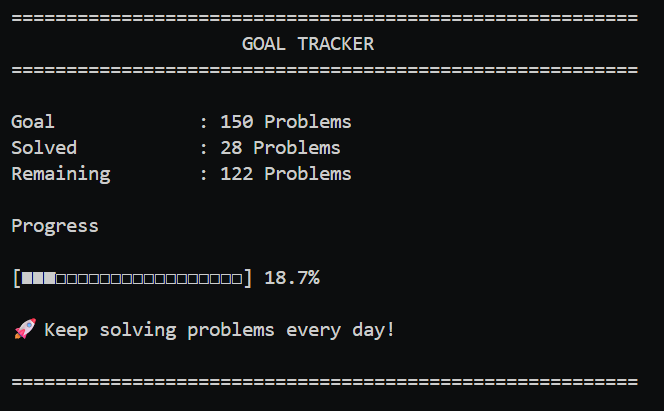
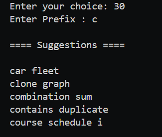
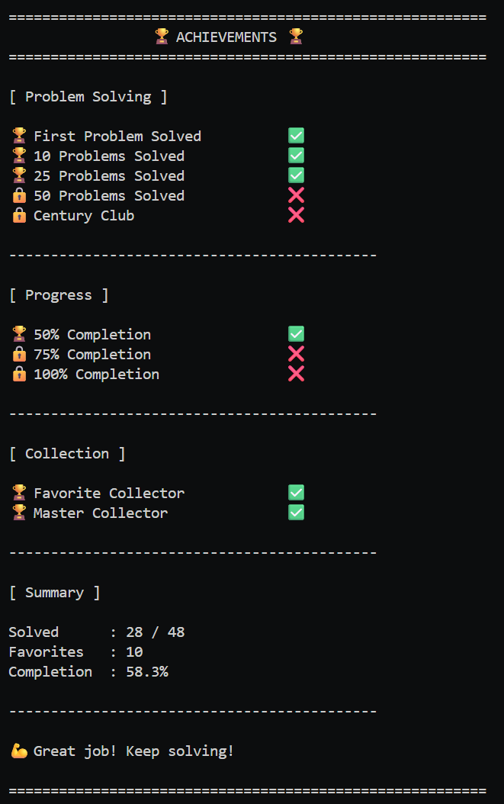
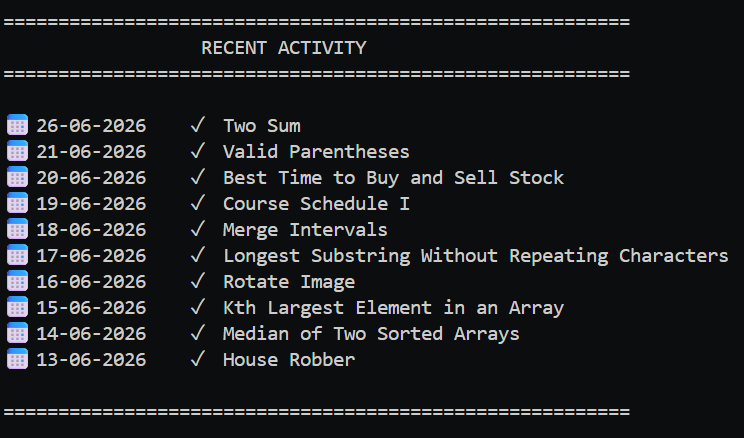

# LeetCode Progress Tracker


## Overview

A feature-rich C++ console application for tracking, organizing, and analyzing LeetCode problem-solving progress. It helps users manage coding practice efficiently with statistics, analytics, streak tracking, goals, favorites, and persistent file storage.

## Features

### Problem Management
- Add Problem
- Edit Problem
- Delete Problem
- Mark as Solved
- Mark Favorite

### Search
- Search by Name
- Prefix Search (Trie)
- Search by Topic
- Advanced Search

### Analytics
- Analytics Dashboard
- Difficulty Heatmap
- Topic Statistics
- Recommendation System
- Weak Topic Detection

### Progress Tracking
- Goal Tracker
- Current Streak
- Recent Activity
- Achievement System

### Data Management
- Export CSV
- Persistent Storage
- Auto Save
- Auto Load

## Technologies Used

- C++17
- Standard Template Library (STL)
- Vector
- Map
- Unordered Map
- Trie
- File Handling
- Lambda Expressions
- StringStream


## File Structure

```text
.
├── data
│   ├── problems.txt
│   ├── goal.txt
│   └── problems.csv
│
├── include
│   ├── Problem.h
│   ├── Tracker.h
│   ├── Trie.h
│   ├── Utils.h
│   └── FileManager.h
│
├── src
│   ├── main.cpp
│   ├── Tracker.cpp
│   ├── Trie.cpp
│   ├── Utils.cpp
│   └── FileManager.cpp
│
├── assets
│   ├── main-menu.png
│   ├── analytics-dashboard.png
│   └── prefix-search.png
│
├── README.md
└── .gitignore
```


---

## How to Run

### Compile

```bash
g++ src/*.cpp -I include -o LeetCodeTracker
```

### Run

```bash
./LeetCodeTracker
```

## Data Storage

All application data is stored inside the `data/` folder.

- `problems.txt` → Stores all problems
- `goal.txt` → Stores user's goal
- `problems.csv` → Exported CSV file

## Data Format

```
ProblemName|Difficulty|Topic|SolvedStatus|SolvedDate|Favorite
```

### Example:

```
Two Sum|Easy|Array|1|22-06-2026|1
Coin Change|Medium|DP|0|Not Solved|0
```

## Key Highlights

- Modular C++ Project Structure
- Trie-based Prefix Search
- Goal Tracking System
- Coding Streak Calculation
- Analytics Dashboard
- Topic Weakness Detection
- Difficulty Heatmap
- Achievement Unlock System
- CSV Export Support
- Fast Topic Search using Hash Map
- Automatic Data Persistence

## Future Improvements

- Login System
- Password Protection
- Graphical User Interface (GUI)
- Online LeetCode API Integration
- Difficulty-based Daily Challenge
- Progress Charts and Graphs
- Database Support (SQLite/MySQL)
- Dark Mode GUI
- Cloud Backup
- Multiple User Profiles


---

## Author

**Aditya Kumar**

- IIT Kharagpur

## Screenshots

### Main Menu



### Analytics Dashboard



### Recommended Problems



### Difficulty HeatMap



### Goal Tracker



### Prefix Search



### Achievements



### Recent Activity

